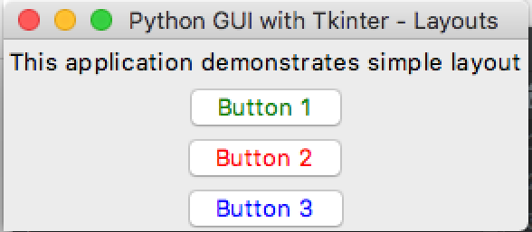
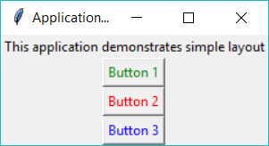

# Organising Layout and Widgets

## Your Task
create a simple program with;
- one label,
-  and three buttons.

### Expected Output
Your program should look something like this.

    
Apple Mac (click to expand)

    
Microsoft Windows (click to expand)

## What is this all about?
### Frame layout
The `pack()` command places labels in the window. It is the simplest layout method for placing widgets in the window.

### Geometry Management
All widgets in the Tkinter window will have some geometry measurements, like height or width. These measurements help organise the placement of the widgets within their parent frames or window.

Tkinter has the following three Geometry layout types.

Layout Type | Description
---|---
`pack()` | It organizes the widgets into a block, which mean it occupies the entire available width. It's a standard method to show the widgets in the window. Think of it like cramming everything in a school bag.
`grid()` | It organizes the widgets in a table-like structure with rows and columns. Very handy for forms.
`place()` | It's used to place the widgets at a specific position you want.

***
 
>## TL;DR
>All this Too Long; Didn't Read it, huh?
>1. You must lay out your widgets in your window otherwise you can't see them.
>2. `pack()` is the easiest way to do this, but not the best.

## _Want to Know More?_
- Try changing the label of your buttons.
- Or add another Label after the buttons - don't forget to pack it!

