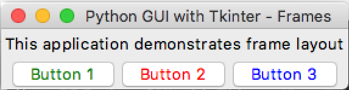
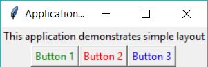

# Frames

## Your Task
Improve the program from the last lesson;
- Finish creating the three buttons.
- Pack the buttons into the frame (the frame is already packed into the window).

### Expected Output
Your program should look something like this.
<details>
    <summary>Apple Mac (click to expand)</summary>


</details>

<details>
    <summary>Microsoft Windows (click to expand)</summary>


</details>

## What is this all about?


To realise this layout of the objects we will use the widget called `Frame()`. Frame allows us to group other widgets together so that we can place them easier. 

```
top_frame = Frame(window)
bottom_frame = Frame(window)
top_frame.pack()
bottom_frame.pack()
```
Both `top_frame` and `bottom_frame` are placed in the window. That’s why we used the `pack()` command to place them in the window.

Look carefully at the code below, notice how the label and three buttons are in different frames.
```
text1 = Label(top_frame , text = "This application demonstrates frame layout")
button1 = Button(bottom_frame, text = "Button 1" , fg = "green")
button2 = Button(bottom_frame, text = "Button 2" , fg = "red")
button3 = Button(bottom_frame, text = "Button 3" , fg = "blue")
```

### Aligning widgets
We still place them in the window using the `pack()` command, and we choose which side the widget will be aligned to with the `side` option;

Option | Description
---|---
`side=LEFT` | align widget to the left side.
`side=RIGHT` | align widget to the right side.
`side=TOP` | align widget to the top side.
`side=BOTTOM` | align widget to the bottom side.

```
text1.pack()
button1.pack(side = LEFT)
button2.pack(side = LEFT)
button3.pack(side = LEFT)
```

***
>## TL;DR
>All this Too Long; Didn’t Read it, huh?
>
>1. Organise the layout of widgets with `Frames()` - the window is also a Frame.
>2. Align widgets with the `side` configuration option

## _Want to Know More?_
- Try the `expand` or `fill` configuration options and see what they do. For more details head over to the [Python docs](https://docs.python.org/3/library/tkinter.html#packer-options) page.
