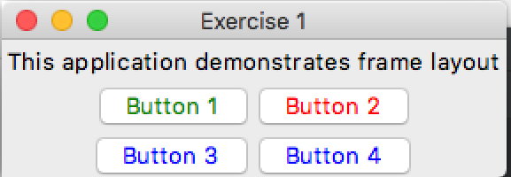
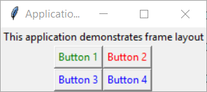

# Exercise 1 - Widgets and Layouts

## Your Task
Make a program with;
- 4 buttons and 1 label that matches the expected output.

### Expected Output
Your program should look something like this.

    
Apple Mac (click to expand)

    
Microsoft Windows (click to expand)

