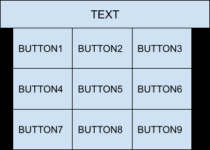
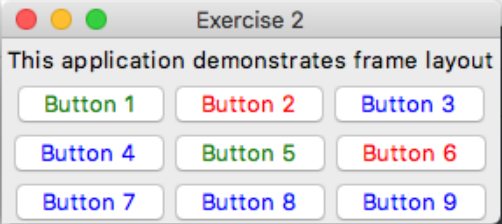
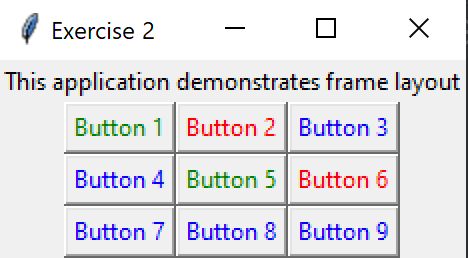

# Exercise 2 - Widgets and Layouts

## Your Task
Make a program with; 
- 9 buttons and 1 label that matches the following layout.

### Expected Output
Your program should look something like this.

    
Apple Mac (click to expand)

    
Microsoft Windows (click to expand)

### Hints

    
hint

four frames might help ...

    
hint

  Those buttons look to be side, by (LEFT) side ...

