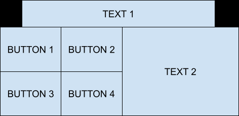
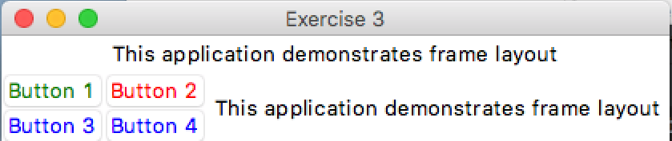
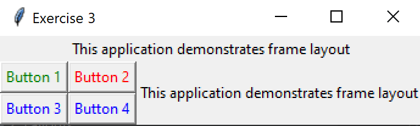

# Exercise 3 - Widgets and Layouts

## Your Task

- Make a Tkinter window with 4 buttons and 2 labels that matches the above layout.

### Expected Output
Your program should look something like this.

    
Apple Mac (click to expand)

    
Microsoft Windows (click to expand)

### Hints

    
hint 1

  You can put a frame into another frame with, <code>little_frame = Frame(big_frame)</code>

    
hint 2

    Some frames might need to be on the LEFT side and others on the RIGHT side ...

    
hint 3

  Instead of the window variable, try passing another frame as an argument when you call the <code>Frame()</code> command

