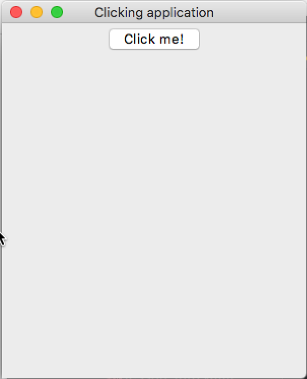
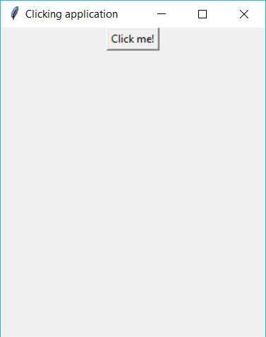

# A Working Button

## Your Tasks
1. Complete the code to make the window and button.
2. Choose a name for the function that will be run when the button is pressed.
<details>
    <summary>hint</summary>

For example,

```
# 2. define functions
def clicked():
   print("Hello there, I am working")
```

</details>

3. Now change the way you make your button by adding the `command=clicked` argument.
<details>
    <summary>hint</summary>

For example.
```
button1 = Button(window, text="Click me!", command=clicked)
```
</details>

>This tells it about your function.
>
>Now we have added the “command” tag inside the Button brackets and assigned which function should be applied when we click on the button.

### Expected Output
Your program should look something like this.
<details>
    <summary>Apple Mac (click to expand)</summary>


</details>

<details>
    <summary>Microsoft Windows (click to expand)</summary>


</details>

## What is this all about?
In this simple exercise, you created a clickable button that printed the message “Hello there, I am working” in the run window.

Buttons (and many other widgets) can be configured to call functions on command. This is the best way to make working apps that perform functions when users interact with the GUI.

***
>## TL;DR
>All this Too Long; Didn’t Read it, huh?
1. Tell the button which command/function to run when it's clicked `command=my_function`.
2. Now, clicking the button will execute code in `my_function`.
3. When you tell the button the name of the function to run - don't include the `()`.

## _Want to Know More?_
- What else can you do with a button? Try passing the `activebackground="red"` configuration argument to your button to see what it does.
  - check out the [Tk widget options documentation](https://tcl.tk/man/tcl8.6/TkCmd/options.htm#M-activeforeground) pages for more information. 
