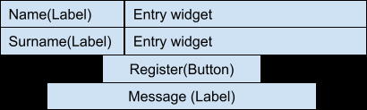
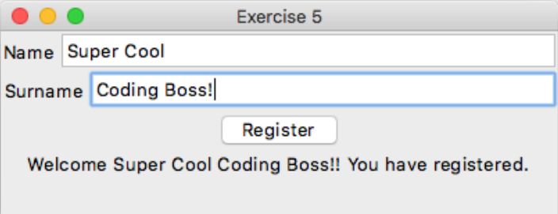
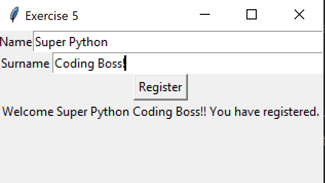

# Exercise 5 - Commands with Buttons

## Your Task
1. Create a program with;
   1. 3 label widgets,
   2. 2 entry widgets, and
   3. 1 button.
Your program should have the following layout.

2. Make the 'Register' button run a command that will change the 'Message' into a welcome message.

Like so,
```
 "Welcome " + name + " " + surname + "! You have registered."
```

### Expected Output
Your program should look something like this.
<details>
    <summary>Apple Mac (click to expand)</summary>


</details>

<details>
    <summary>Microsoft Windows (click to expand)</summary>


</details>

## _Want to Know More?_
- Find out what the options "fill" and "expand" do over on the [Python Docs packer](https://docs.python.org/3/library/tkinter.html#packer-options) page.
