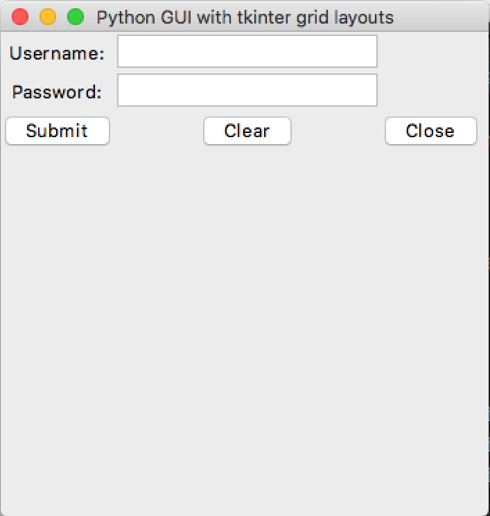
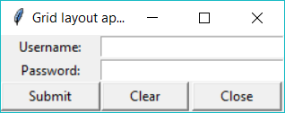

# Using the grid layout

## Your Task
Create a program with
- A grid layout
- Place the widgets using the `grid()` layout.
- You do NOT have to make the buttons work in this lesson.

### Expected Output
Your program should look something like this.

    
Apple Mac (click to expand)

    
Microsoft Windows (click to expand)

## What is this all about?
Previously we have used the `pack()` command to place an object inside the window.
Here we use the `grid()` command to place an object. 

The `pack()` command allows us to place widgets at the TOP, LEFT, RIGHT or BOTTOM of the containing `Frame` or `Window`.

Whereas, the `grid()` command allows us to place widgets in a row and column.

In the above image;
- `username_label` is placed in the row zero, column zero.
- `username_entry` is placed in the row zero, column one.
- `password_label` is placed in the row one, column zero.
- `password_entry` is placed in the row one, column one.
- `submit_button` is placed in the row two, column zero.
- `clear_button` is placed in the row two, column one.
- `close_button` is placed in the row two, column two.

**As you have seen from the previous lesson, numbering of the rows and columns start with 0.**

### Need more than one column - use Columnspan
You can also make widgets take up more than one column or row.
Use the `columnspan=` config option to stretch a widget over adjacent columns.

**_What do you think the config option for increasing row spans is called?_**
 
***
>## TL;DR
>All this Too Long; Didn't Read it, huh?
>1. Use `button1.grid(row=0, column=0)` to place a button widget in the top left of a window.
>2. Use `button1.grid(row=0, column=0, rowspan=2)` to place a button widget in the two top left rows of the windows column 0.

## _Want to Know More?_
- What can you do to control the positioning of content within a grid cell?
  - Try using the `sticky="w"` configuration option in your `grid()` command.
  - To find out what the `"w"` means check out the [Tk documentation on the grid Geometry manager](https://tcl.tk/man/tcl8.6/TkCmd/grid.htm).
