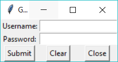
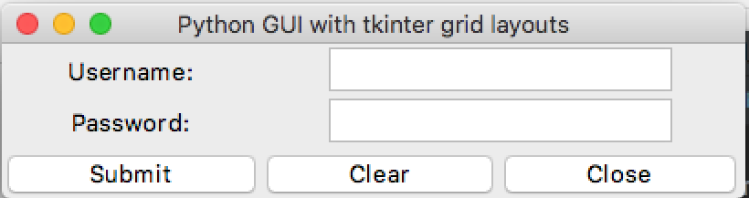
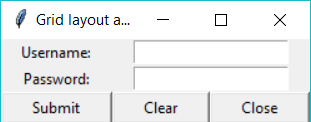

# Column spans and padded grid layouts

In the last lesson we created a GUI with all the right widgets, but the button placement looked weird and full of gaps.



## Your Task
- Improve the layout of the buttons to look like the expected output.

### Expected Output
Your program should look something like this.
<details>
    <summary>Apple Mac (click to expand)</summary>


</details>

<details>
    <summary>Microsoft Windows (click to expand)</summary>


</details>

## What is all this about?
The padding option adjusts the width of the buttons.
Padding means when we add some space between the border and the widget.

The `.grid()` function has two types of padding options: 
1. `ipadx=` for internal padding and,
2. `padx=` for padding outside the widget.

Applying the `ipadx` padding config will apply padding along the x-axis to change the width of the buttons.

Here, we used `ipadx` to pad  the button out by 20 pixels in width;
`close_button.grid(row=2, column=2, ipadx=20)`

***
>## TL;DR
>All this Too Long; Didn't Read it, huh?
>1. Use `button1.grid(ipadx=30)` to make buttons 30 pixels wider.
>2. Use `button1.grid(padx=30)` to make the text on a button 30 pixels away from the button edges.

## _Want to Know More?_
- How can we modify an entire row? Try and add a 5 pixel pad to each button _after_ placing them in the grid.
  - You can use the command `grid_slaves()` to returns a list (sequence of objects) of objects in the grid held in the `window` container.
    - `grid_slaves()` can return row and column or the entire grid - check out the [Tk documentation on the grid slaves command](https://tcl.tk/man/tcl8.6/TkCmd/grid.htm#M27).
<details>
    <summary> Don't peek at this answer unless you are stuck!</summary>

```
for widget in window.grid_slaves(row=2):
    widget.grid(padx=2)
```
</details>
