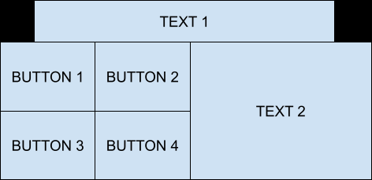

# Exercise 6 - Grid layout
## Your Task
Apply a grid layout to create a window with the following look.

    
hint

  Remember the `columnspan` configuration option? Well you can also use `rowspan`.

