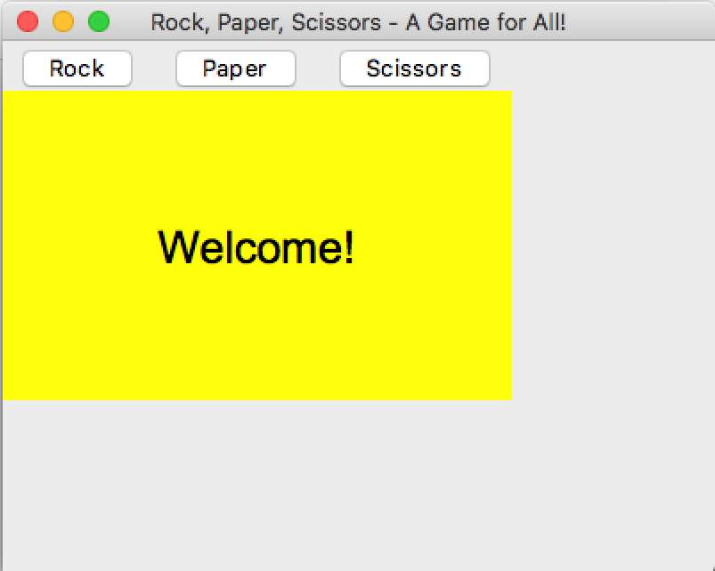
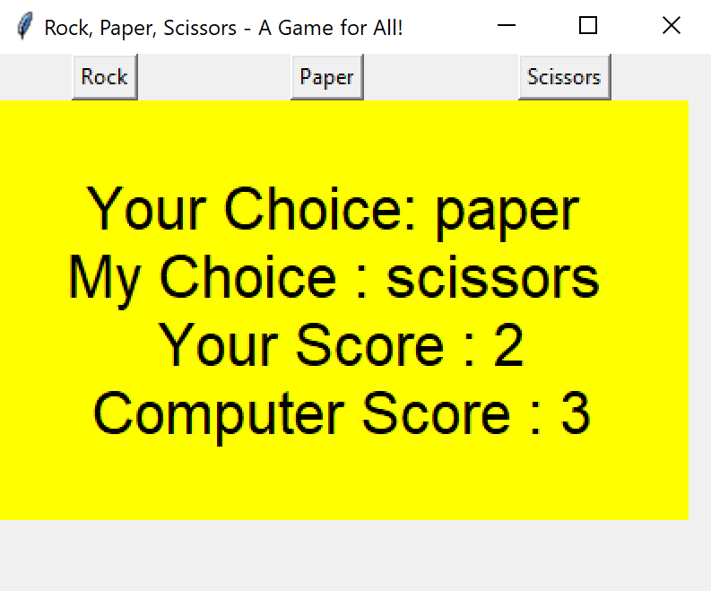

# Basic Assessment Task

## Your Task
Create a rock, paper scissors game, where:

1. The user must be able to choose rock, paper, or scissors.
2. Your program must randomly choose rock, paper, or scissors.
3. Your program must keep a running score for the human and computer players
4. The program must output the following:
   1. Players choice
   2. Computer opponents' choice
   3. Players current score
   4. Computer opponents' current score

### Hints

   
hint

  Labels have config options for height and width, but it is measured in characters - not pixels.

### Include at least one of each widget
- Button widget
- Label widget

### Expected Output
Your program should look something like this.

    
Apple Mac (click to expand)

    
Microsoft Windows (click to expand)

