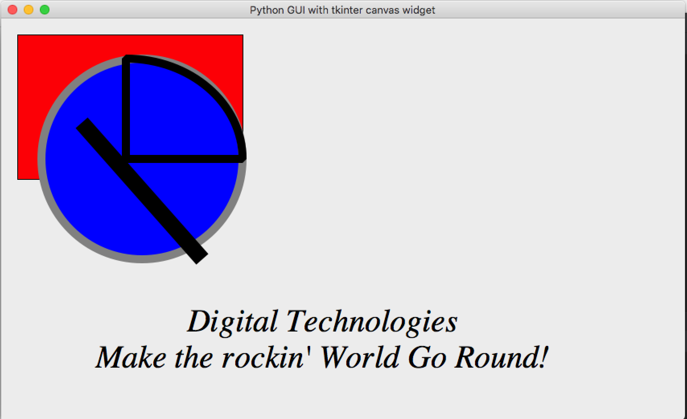
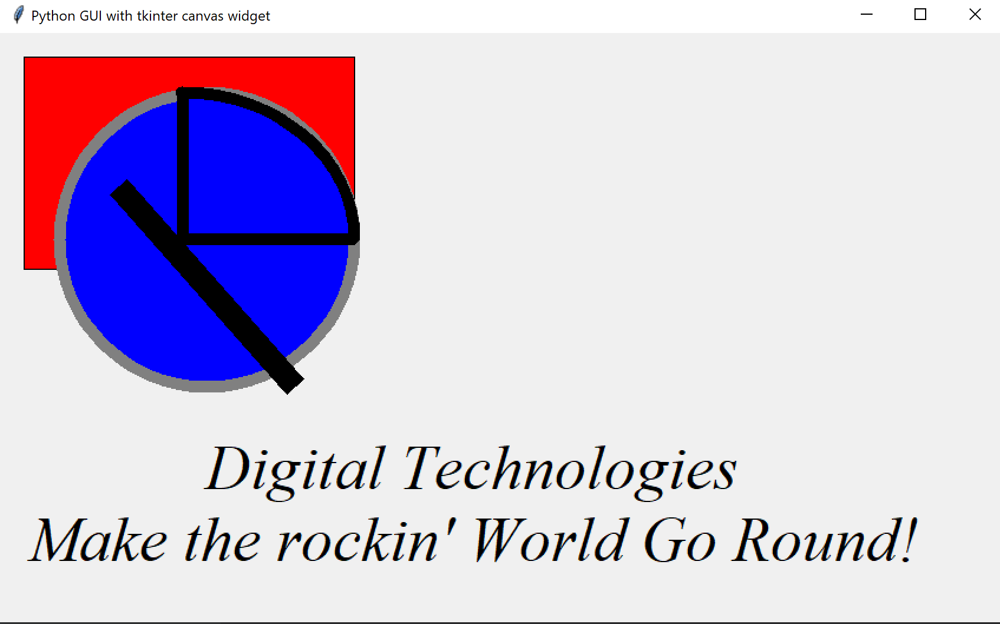

# Canvas widget

## Your Task
- Complete the code by adding:
  - 1 arc
  - 1 line
  - 1 rectangle
  - 1 oval
  - and 1 text element

## What is this all about?
Canvas is the widget where you can draw everything you want.

Most GUI frameworks have this widget because, while it can be used for drawing it can also be used for animations.

If we want our widget to fill all the free space of the window, we can use the `.pack(fill=BOTH)` config option. 

There are 3 ways we can apply fill: **X**, **Y**, and **BOTH**. 

### The commands to draw shapes
Name | Description
---|---
create_rectangle() | Draw a rectangle
create_line() | Draw a line
create_oval() | Draw an oval
create_polygon() | Draw a polygon with several points
create_arc() | Draw an arc line
create_text() | Put text on the canvas

**When we create shapes on the canvas, we can assign them to a variable if we want to modify them later.**

 

* To draw the rectangle, line, or oval we need to input four coordinates.
* `x1` and `y1` will be the coordinates of the first point and `x2`, `y2` will be the coordinates of the second point.
  * The origin (0, 0) coordinates start at the left top corner of the canvas. 
  * Measurement is in pixels.

Shape Parameter | Description
---|---
fill | fill paint colour.
outline | colour of the border.
width | width of the border.
dash | border line type.

### Expected Output
Your program should look something like this.

    
Apple Mac (click to expand)

    
Microsoft Windows (click to expand)

***
>## TL;DR
>All this Too Long; Didn't Read it, huh?
> 
> use the canvas widget to make drawings or animations

## _Want to Know More?_
- In the code we use the `expand = 1` command, what do you think it does? Try experimenting or researching online to find out.

