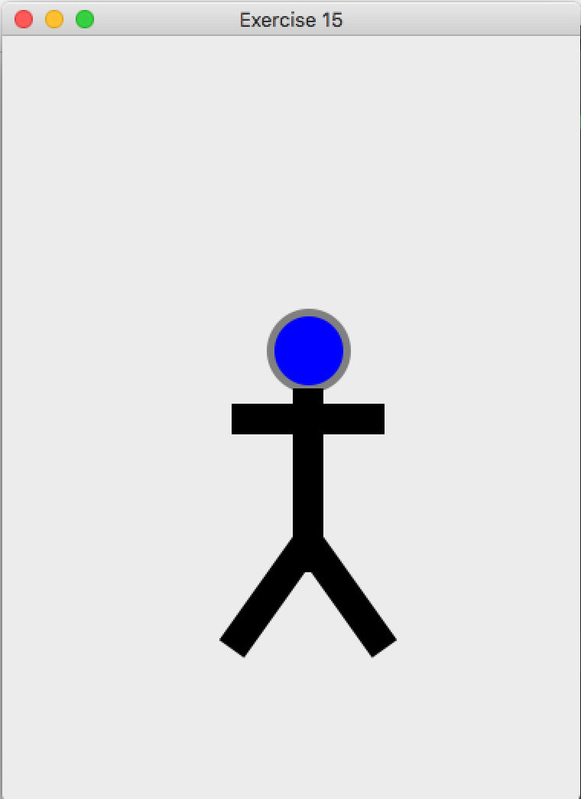
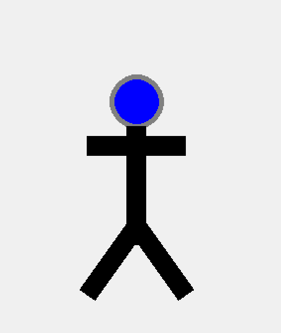

# Exercise 15 - Drawing with code

## Your Task
- Create a program that will draw a figure on the canvas.
  - I used lines and ovals, why don't you try different shapes?

### Expected Output
Your program should look something like this.

    
Apple Mac (click to expand)

    
Microsoft Windows (click to expand)

