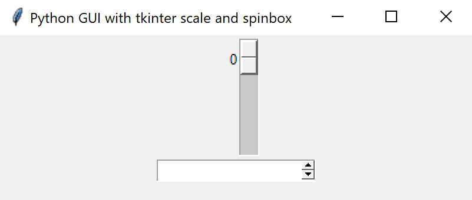
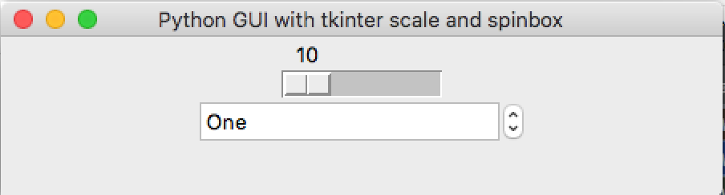
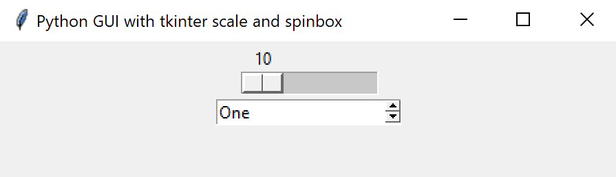

# Scale and Spinbox Widgets
## Your Task
- Create a window.
- Pack the widgets into the window.
- Make the scale widget horizontal.
- Give the spinbox some values.
## What is this all about?
You already know about the label, button, entry, and canvas widgets. In this lesson we will learn about the scale and spinbox widgets.
 
## Scale and spinbox widgets
By default, our scale widget is aligned vertically, and the spinbox widget has no value.

There are some options that we can apply to configure these widgets.

Both widgets have similar options 

Option | Description
---|---
`from_` | starting value of the range
`to` |  finishing value of the range

To align the scale widget, we can use the `orient=HORIZONTAL` option.

We can also assign values to spinbox by using a tuple `values = ("One","Two","Three")`.

### Expected Output
Your program should look something like this.

    
Apple Mac (click to expand)

    
Microsoft Windows (click to expand)

***
>## TL;DR
>All this Too Long; Didn't Read it, huh?
>
>1. Use the `Spinbox()` widget to create input controls that limit input to a range of values.
>2. Use the `Scale()` widget to create a sliding input control that limits input to a numerical range.

## _Want to Know More?_
* Tuples are (very cool) read-only lists.

