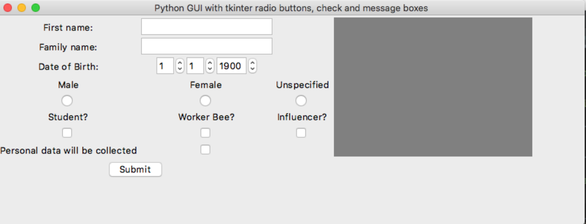
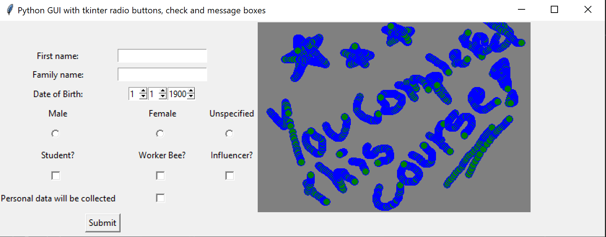

# Intermediate Assessment Task

## Your Task
Create an art competition program, where:

1. The user must be able to draw a picture.
2. The user must complete a form before the artwork is accepted into the prize draw. 
3. The user must provide 
   1. First name,
   2. Family name,
   3. Date of birth (use a spinbox),
   4. Gender (use radio box),
   5. Current occupation [student, worker bee, influencer] (use check buttons),
4. Give permission for this personal data to be collected (use check button),
   1. Show a message box with a polite warning if data permission is not given

**Your program does not need to save the drawing**

### Include at least one of each widget
- Canvas widget
- Scale widget
- Spinbox widget
- Radio button
- Check button
- Message box

Your program should look something like this.

    
Apple Mac (click to expand)

    
Microsoft Windows (click to expand)

